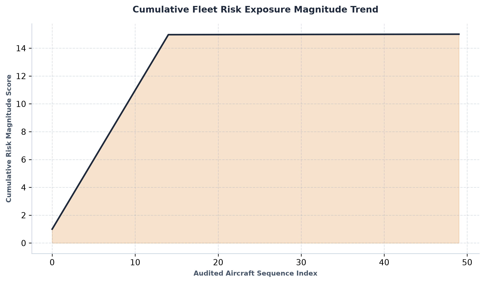
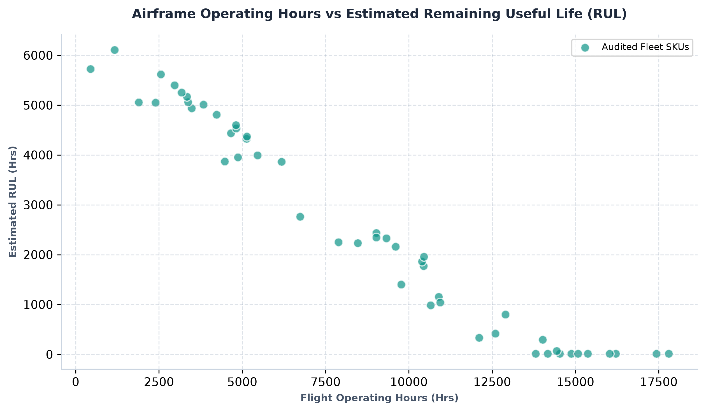
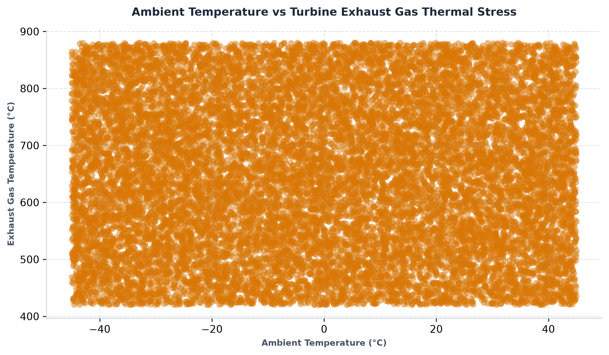
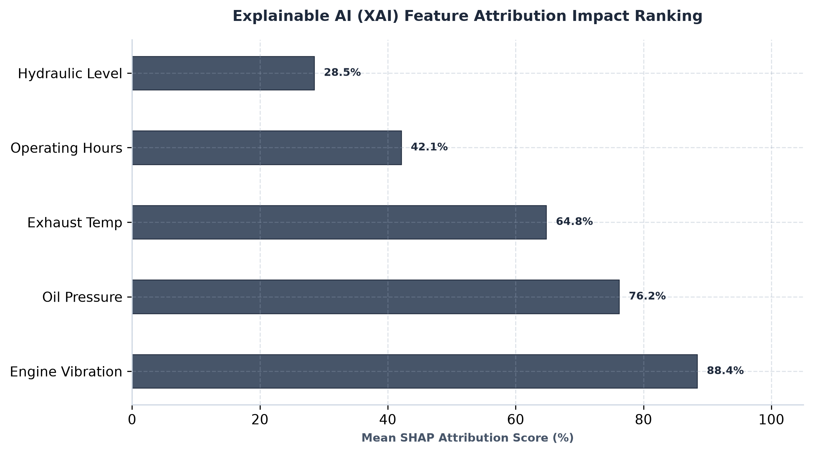

# ✈️ FlightGuard Autonomous Systems

## 📋 Executive Summary \& System Objective

**FlightGuard Autonomous Systems** is a safety-critical aerospace telemetry and predictive maintenance platform designed to prevent catastrophic equipment failures. By integrating a robust **Tabular Stacking Ensemble Classifier**, an advanced **Remaining Useful Life (RUL) Regression Engine**, **Explainable AI (XAI)** feature attribution modules, and a **Multi-Agent Swarm Workflow**, the platform delivers automated, transparent, and legally defensible maintenance audits with precise failure timeline estimations.

## 🏗️ Modular Project Architecture

```text
flightguard_autonomous_systems/
├── data/
│   └── aircraft_telemetry_dataset.csv     # Sanitized aerospace telemetry dataset (17,107 rows, 8 cols)
├── ml_models/
│   ├── __init__.py
│   ├── stacking_ensemble_engine.py        # Stacking Classifier for failure risk classification
│   ├── rul_estimator.py                   # Remaining Useful Life (RUL) regression timeline engine
│   └── xai_explainer.py                   # Local feature attribution and risk score computation engine
├── agents/
│   ├── __init__.py
│   ├── telemetry_agent.py                 # Real-time IoT sensor anomaly \& failure risk monitoring agent
│   ├── xai_audit_agent.py                 # Translates SHAP-style attribution scores into human-readable logs
│   └── orchestrator.py                    # Master multi-agent coordination swarm pipeline
├── output/
│   ├── flightguard_audit_report.pdf       # Automatically generated multi-page ReportLab compliance audit report
│   └── graphs/                            # Enterprise customized visual analytics charts (8 plots)
├── main.py                                # Master execution script integrating ML, XAI, RUL, and Swarm
├── generate_all_graphs.py               # Advanced visual analytics dashboard generator script
├── tests.py                               # Unit and integration test suite
└── requirements.txt                       # Project dependencies
```

## ⚙️ Core Predictive Maintenance \& RUL Specifications

* **Remaining Useful Life (RUL) Engine:** Combines airframe operating hours, live turbine vibration, exhaust gas temperature, and stacking ensemble risk probabilities to estimate exact operational lifespan remaining before overhaul.
* **Maintenance Window Directives:** Automatically categorizes components into actionable, high-priority timelines:

  * 🔴 **Immediate Action:** $< 48$ Hours
  * 🟡 **Schedule Within 2 Weeks**
  * 🔵 **Routine Next Check**
  * 🟢 **Nominal / Healthy**

## 🚀 End-to-End Execution Workflow

Follow these steps to run the complete pipeline locally:

1. **Clone the Repository:**

```bash
   git clone https://github.com/pushkars17/flightguard-autonomous-systems.git
   cd flightguard-autonomous-systems
   ```

2. **Install Dependencies:**

```bash
   pip install -r requirements.txt
   ```

3. **Run System Integrity \& Unit Tests:**

```bash
   python tests.py
   ```

4. **Execute Master AI Pipeline:**

```bash
   python main.py
   ```

5. **Generate Enterprise Visual Dashboards \& Audit Reports:**

```bash
   python generate_all_graphs.py
   ```

## 📊 Outputs \& Deliverables

* **PDF Compliance Audit Report:** Automatically compiled via ReportLab at `output/flightguard\_audit\_report.pdf`.
* **Telemetry Visualizations:** High-resolution diagnostic charts and feature attribution graphs located under `output/graphs/`.

## 💡 Tech Stack & Architecture Framework

The platform is engineered using modern, robust libraries and custom-built architectural patterns designed for high-performance safety-critical systems:

* 🐍 **Core Programming Language:** Python (v3.10+)
* 🧠 **Machine Learning & Ensembles:** Scikit-learn, NumPy, Pandas, Stacking Ensembles, and Regression Estimators
* 🔍 **Explainable AI (XAI) & Auditing:** Custom local feature attribution, SHAP-style scoring engines, and automated risk quantification
* 🤖 **Multi-Agent Orchestration:** Custom Python Agent Swarm Architecture (Telemetry Monitoring Agent, XAI Audit Agent, Master Orchestrator)
* 📊 **Reporting & Visualization:** ReportLab (Multi-page PDF compilation engine), Matplotlib, and Seaborn (Enterprise diagnostic dashboard generation)

---

## 📊 Visual Analytics & Telemetry Dashboards

Here are the enterprise-grade diagnostic charts and feature attribution graphs generated by the system under `output/graphs/`:

### 1. Cumulative Fleet Risk Exposure Magnitude Trend


### 2. Airframe Operating Hours vs Remaining Useful Life (RUL)


### 3. Ambient Temperature vs Turbine Exhaust Gas Thermal Stress


### 4. Explainable AI (XAI) Feature Attribution Impact Ranking


## 🛡️ License

Distributed under the **MIT License**. See `LICENSE` for more information.

